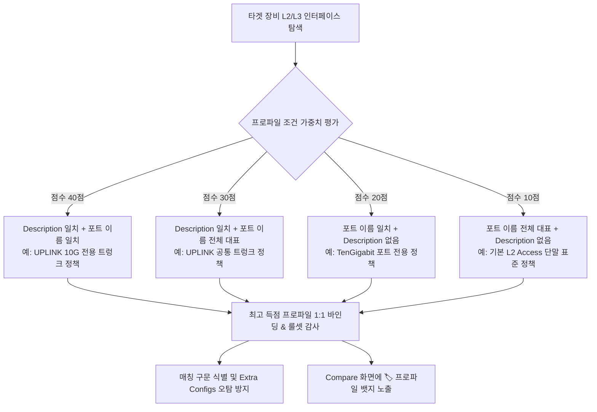

# Network Config Auditor (FastAPI + ciscoconfparse2 + Ollama)

Cisco IOS-XE, NX-OS, IOS-XR, AireOS (WLC) 및 IOS 설정 파일을 계층적으로 정밀 분석하고, 골든 컨피그(Golden Config)를 기준으로 규정 준수 감사(Audit), **미인가 추가 설정 Diff(Extra Configs)**, **보안 위험도 분류(DANGER/WARNING/INFO)** 및 **스마트 롤백 CLI 스크립트**를 원클릭 생성하는 엔터프라이즈 네트워크 감사 솔루션입니다.

---

## 📑 목차
1. [핵심 아키텍처 및 주요 기능](#-핵심-아키텍처-및-주요-기능)
2. [L2/L3 인터페이스 정책 프로파일 & 시맨틱 바인딩](#-l2l3-인터페이스-정책-프로파일--시맨틱-바인딩)
3. [보안 위험도 분류 체계 및 근거 (CIS & DISA STIG)](#-보안-위험도-분류-체계-및-근거-cis--disa-stig)
4. [체계적인 형상 관리 시스템 (Git-Ops Rule & Template System)](#-체계적인-형상-관리-시스템-git-ops-rule--template-system)
   - [DB가 .gitignore 처리된 배경과 해결책](#db가-gitignore-처리된-배경과-해결책)
   - [Git-Ops 선언적 파일 구조](#git-ops-선언적-파일-구조)
   - [지속적 업데이트 및 협업 워크플로우](#지속적-업데이트-및-협업-워크플로우)
5. [기술 스택](#-기술-스택)
6. [설치 및 실행 가이드](#-설치-및-실행-가이드)
7. [E2E 자동화 테스트 검증](#-e2e-자동화-테스트-검증)
8. [프로젝트 디렉터리 구조](#-프로젝트-디렉터리-구조)

---

## 🚀 핵심 아키텍처 및 주요 기능

### 1. `ciscoconfparse2` 기반 계층형 트리 파싱 & 노이즈 정제
- **CiscoConfParse 엔진**: 장비의 계층적 부모-자식 블록 구조(`ConfigTree`)를 완벽하게 유지하여 복잡한 인터페이스, 라우팅, AAA, 방화벽 ACL 구문을 파싱합니다.
- **비설정 노이즈 자동 제거**: 터미널 프롬프트(`Router# show running-config`), 세션 배너, 타임스탬프 로그를 자동으로 필터링합니다.
- **다중 라인 배너 보존**: `banner motd ^C ... ^C`와 같은 특수 딜리미터 배너 블록을 손상 없이 온전히 파싱하고 검사합니다.

### 2. 침묵형 위협 감지 (Extra Config Diff & 100% 준수율 상황 대응)
- 대상 장비가 골든 템플릿의 필수 룰을 100% 만족하더라도, **기준 템플릿에 정의되지 않은 비인가 추가 라인**이 존재할 경우 누락 없이 감지하여 `extra_configs`로 적출합니다.
- **블록 전체 추가 vs 라인 단위 추가 구분**: 새로운 인터페이스나 라우팅 프로세스 등 블록 전체가 추가된 경우(`is_block_extra`)와 기존 블록 내 세부 설정 라인이 추가된 경우를 명확히 구분합니다.

### 3. 지능형 롤백 CLI 및 Clean Config 자동 생성
- **부모 컨텍스트 인식 역명령**: 부모 블록(예: `interface GigabitEthernet1`)에 진입하여 정확한 `no <command>`를 생성하거나, 블록 단위는 최상위에서 `no <block>`으로 일괄 정리합니다.
- **보안 역명령 스마트 복원**: 이미 `no`로 비활성화된 보안 기능(예: `no switchport port-security`)은 `no`를 제거하여 `switchport port-security`로 원상 복구합니다.
- **완결성 보장**: 생성되는 스크립트는 `configure terminal`로 시작하여 `end` 및 `write memory`로 안전하게 완결됩니다.
- **Clean Config 다운로드**: 기준 외 추가 라인만 `! [REMOVED_BY_AUDITOR]` 주석 처리된 무결성 설정 파일을 즉시 생성 및 다운로드할 수 있습니다.

### 4. 템플릿 실시간 동기화 & 영향도 감지 (Reactive State Engine)
- Golden 탭에서 템플릿을 수정·저장하면 Compare 탭 상단에 **실시간 변경 감지 배너**가 즉시 활성화됩니다.
- 변경된 룰셋을 현재 화면에 즉시 재감사할 것인지, 아니면 이전 상태로 롤백할 것인지 직관적인 팝업과 인터랙션을 제공합니다.

---

## 🏷️ L2/L3 인터페이스 정책 프로파일 & 시맨틱 바인딩

스위치와 라우터의 수십~수백 개 인터페이스 포트는 장비 기종마다 포트 명명 규칙(예: `GigabitEthernet0/0/1` vs `TenGigabitEthernet1/0/48`)이 다르고, 포트의 역할(Access 단말용, Core/Dist Uplink용, AP용 등)에 따라 요구되는 보안/네트워크 설정이 완전히 다릅니다.

본 솔루션은 포트 이름을 특정하지 않아도 **포트 패턴 조건**과 **Description(설명) 시맨틱 단서**를 결합하여 최적의 인터페이스 룰셋을 동적으로 바인딩하고 일괄 감사하는 **인터페이스 정책 프로파일 아키텍처**를 제공합니다.

### 1. 포트 이름 4대 매칭 조건 (단일 패턴으로 전체 대표)
| 매칭 조건 (Condition) | 설명 | 설정 예시 | 적용 대상 |
| :--- | :--- | :--- | :--- |
| **`exact`** | 지정한 포트 이름과 100% 동일한 인터페이스만 대상 | `GigabitEthernet0/0` | 관리용(MGMT) 포트, 특정 고정 포트 |
| **`contains`** | 포트 이름에 특정 문자열이 포함된 인터페이스 대상 | `TenGigabitEthernet` | 10G/40G 고속 업링크 전용 포트군 |
| **`regex`** | 정규표현식 패턴에 부합하는 인터페이스 대상 | `^(Gigabit\|TenGigabit)[0-9]/[0-9]/4[0-8]$` | 40번대 이후의 특정 모듈 포트군 |
| **`exists`** | **조건값 생략(또는 `.*`) 시 전체 L2 또는 L3 인터페이스를 대표(대변)** | (비워둠) | **스위치 전체 Access 포트, 라우터 전체 Routed 포트 기본 표준** |

### 2. Description 패턴 기반 시맨틱 동적 바인딩
포트 이름이 무엇이든 네트워크 엔지니어가 설정한 `description`의 키워드나 정규식 패턴을 판별하여 필요한 필수/선택 룰을 타겟팅합니다.

- **`contains`**: Description에 특정 키워드가 포함될 때 적용 (예: `UPLINK`, `TO-CORE`, `SERVER`, `AP-`)
- **`regex`**: Description에 특정 정규식이 매칭될 때 적용 (예: `^(CORE|DIST)-SW[0-9]+`)
- **`exact`**: Description이 지정 문자열과 완전 일치할 때 적용
- **`exists`**: Description이 1줄이라도 존재하는 모든 포트 대상
- **`none`**: Description 조건을 보지 않고 인터페이스 이름 패턴만으로 판정

### 3. 지능형 우선순위 판정 알고리즘 (Priority Scoring)
타겟 장비의 각 L2/L3 인터페이스마다 등록된 프로파일들을 가중치 점수 기반으로 자동 평가하여, **가장 구체적인 단 하나의 프로파일을 1:1로 엄격하게 바인딩**합니다.



### 4. 웹 UI 설정 및 사용 가이드
1. **프로파일 관리 화면 진입**:
   - `Golden` 탭에서 골든 템플릿 카드를 클릭하여 설정 드로어를 엽니다.
   - 드로어 상단의 **[🏷️ 인터페이스 정책 (L2/L3 Profiles)]** 서브탭을 클릭합니다.
2. **신규 프로파일 등록**:
   - **[+ 정책 프로파일 추가]** 버튼을 클릭하면 프로파일 설정 모달이 나타납니다.
   - **프로파일 이름**: 정책 식별자 입력 (예: `L2 트렁크 업링크 표준`, `일반 Access 포트 보안`)
   - **적용 인터페이스 타입**: `L2 Switchport` 또는 `L3 Routed Interface` 선택
   - **포트 이름 매칭 조건**: `전체 대표(exists)`, `문자열 포함(contains)`, `정규표현식(regex)`, `완전 일치(exact)` 중 선택
   - **Description 매칭 조건**: `조건 없음(none)`, `문자열 포함(contains)`, `정규표현식(regex)` 등 선택 후 매칭값 입력
3. **인터페이스 필수/선택 명령어 룰셋 등록**:
   - 모달 하단 테이블에서 포트에 반드시 들어가야 할 설정(예: `switchport mode trunk`, `switchport nonegotiate`, `spanning-tree portfast`)을 행 단위로 추가합니다.
   - 각 명령어마다 조건(`exact`, `contains`, `regex`, `exists`) 및 필수 여부(Mandatory)를 설정합니다.
4. **저장 및 감사 실행**:
   - **[프로파일 적용]** 후 우측 상단 **[템플릿 저장]**을 완료합니다.
   - Compare 탭에서 감사를 실행하면 대상 인터페이스 헤더에 `🏷️ <프로파일명>` 뱃지가 표시되며, 해당 프로파일 기준의 준수율 감사와 스마트 롤백 스크립트가 자동 도출됩니다.

### 5. 계층형 설정 룰 vs 인터페이스 정책 프로파일의 관계 및 위임 원칙
- **역할 분담 원칙**:
  - **계층형 설정 룰의 인터페이스**: `Loopback0`(장비 Router-ID), `Management0`(OOB 원격 관리), 특정 관리 VLAN SVI 등 **모든 장비에 반드시 고정된 1개의 이름으로 존재해야 하는 특수 인터페이스**에만 선별 적용합니다.
  - **인터페이스 정책 프로파일**: 수십~수백 개의 **일반 물리 포트(L2 Access, Trunk, AP, Server 연결 등)**를 일괄 동적 감사합니다.
- **원클릭 프로파일 위임(Delegation)**:
  - 룰 편집기(Rule Editor)의 `interfaces_l2` 및 `interfaces_l3` 블록 상단에 안내 배너와 함께 **[🏷️ 인터페이스 정책으로 위임 (선택 해제)]** 버튼이 제공됩니다.
  - 클릭 한 번으로 수십 개의 물리 포트 선택을 일괄 해제하여, 하드코딩된 고정 포트 룰 대신 유연한 인터페이스 정책 프로파일이 모든 포트를 자동 감사하도록 손쉽게 위임할 수 있습니다.

---

## 🛡️ 보안 위험도 분류 체계 및 근거 (CIS & DISA STIG)

본 시스템의 추가 설정 Diff 엔진은 단순한 텍스트 비교를 넘어, 네트워크 보안의 양대 국제 표준인 **CIS Cisco IOS Benchmark (v4.1.0)** 및 **미 국방부 DISA Network Infrastructure STIG** 기준에 따라 위험도를 3단계(`DANGER`, `WARNING`, `INFO`)로 정밀 판정합니다.

### 보안 위험도 판정 기준표

| 위험도 | 분류 정의 | 준거 표준 (Standard) | 탐지 패턴 예시 | 위험 사유 및 파급력 |
| :---: | :--- | :--- | :--- | :--- |
| **`DANGER`** <br>(치명적) | 원격 장비 장악, 백도어 침투, 트래픽 감청, 전면 접근 통제 무력화 | • CIS 1.1 / DISA STIG NET-0410<br>• CIS 1.2 / DISA STIG NET-0450<br>• CIS 1.3 / DISA STIG NET-0800<br>• CIS 2.1 (L2 Hardening)<br>• CIS 3.1 / DISA STIG NET-0600 | • `username ... priv 15`<br>• `snmp-server community ... rw`<br>• `snmp-server community public`<br>• `transport input telnet`<br>• `ip http server`<br>• `no switchport port-security`<br>• `no service password-encryption`<br>• `permit ip any any` | **장비 전면 탈취 및 보안 무력화**<br>- 비인가 최고 권한 계정으로 관리자 통제권 상실<br>- SNMP 쓰기 권한 노출로 원격 설정 변조<br>- 평문 통신 스니핑을 통한 패스워드 탈취<br>- L2 포트 보안 해제로 MAC 플러딩/비인가 단말 침입 |
| **`WARNING`** <br>(주의/경고) | 트래픽 경로 왜곡, 비표준 라우팅 주입, 공격 표면(Attack Surface) 확장 | • CIS Routing Security<br>• RFC 7454 (BGP Ops)<br>• CIS 1.4 (Unneeded Services)<br>• Network Architecture Policy | • `router ospf ...` / `router bgp ...`<br>• `ip route ...`<br>• `ip vrf ...`<br>• `username <user>` (일반)<br>• `service config`<br>• `ip bootp server` / `ip finger`<br>• `ip address ...` (비인가) | **네트워크 서비스 이상 및 경로 우회**<br>- 비인가 라우팅 프로세스로 인한 경로 누출(Route Leak) 및 루프<br>- 비인가 정적 경로 주입으로 트래픽 비정상 게이트웨이 우회<br>- 불필요한 레거시 서비스 가동으로 취약점 노출 |
| **`INFO`** <br>(일반 정보) | 망 운영상 추가된 비위험 라인, 주석, 표준 변경 사항 | • General Operational Audit | • `description ...`<br>• `ntp server ...`<br>• `logging ...`<br>• 단순 파라미터 미세 조정 | **운영성 변경 사항**<br>- 보안상 위험은 없으나 기준 템플릿과 상이한 형상 변경 이력 추적 |

---

## 📦 체계적인 형상 관리 시스템 (Git-Ops Rule & Template System)

### DB가 `.gitignore` 처리된 배경과 해결책
- **배경**: SQLite 데이터베이스(`webapp/data.db`)는 개별 장비의 감사 이력, 고객사/프로젝트별 실제 운영 설정 스냅샷 등 민감정보를 담고 있으므로 보안 및 저장소 오염 방지를 위해 `.gitignore`에 등록되어 있습니다.
- **발생하는 과제**: 개발자 간 코드 협업 시, 또는 운영 서버로 배포 시 `data.db`가 전달되지 않아 **골든 템플릿과 보안 룰이 누락되는 문제**가 발생합니다.
- **해결책**: 본 프로젝트는 **선언적 파일 기반 Git-Ops 아키텍처**를 구축하여 DB 파일 없이도 Git을 통해 모든 정책과 템플릿을 버전 관리하고 지속적으로 업데이트합니다.

```
[Git Repository (버전 관리)]
 ├── rules/security_rules.json       <-- 공인 보안 룰셋 (Git 커밋)
 └── seeds/templates/*.json          <-- 표준 골든 템플릿 Seed (Git 커밋)
         │
         ▼ (앱 기동 시 자동 시딩 & Settings 탭 동기화)
[로컬 런타임 (data.db - .gitignore)]
 ├── SQLite Tables: templates, results, settings
 └── 사용자 장비 감사 이력 및 로컬 편집 데이터 보존
```

### Git-Ops 선언적 파일 구조

#### 1. 선언적 보안 룰셋: `rules/security_rules.json`
보안 위협도 판정 규칙을 JSON 형태로 선언하여 Git으로 코드 리뷰 및 지속 업데이트를 수행합니다.
```json
[
  {
    "id": "SEC-DANGER-PRIV15",
    "level": "danger",
    "standard": "CIS 1.1 / DISA STIG NET-0410",
    "title": "비인가 최고 관리자(Priv 15) 계정",
    "pattern": "\\busername\\s+\\S+.*\\b(privilege|priv)\\s+15\\b",
    "parent_pattern": "",
    "reason": "골든 룰에 등록되지 않은 Privilege 15 최고 권한 로컬 계정이 추가되어 백도어 및 장비 전면 장악 위험이 있습니다.",
    "remediation": "해당 비인가 계정 삭제 (no username <user>)"
  },
  ...
]
```

#### 2. 선언적 골든 템플릿 Seed: `seeds/templates/*.json`
운영 조직의 장비군별 표준 골든 컨피그 템플릿을 JSON Seed 파일로 유지합니다.
- `seeds/templates/standard-core-iosxe.json`: 엔터프라이즈 백본/코어 스위치 표준 템플릿 예시.

### 지속적 업데이트 및 협업 워크플로우

#### ① 최초 환경 구축 (무손실 자동 시딩)
신규 개발자나 운영 서버에서 `git clone` 후 최초 서버 기동 시:
- 백엔드 시동(`webapp.main:app`) 이벤트에서 `seed_templates_from_disk()`가 자동 실행됩니다.
- DB에 템플릿이 없을 경우 `seeds/templates/*.json` 파일들을 탐색하여 자동으로 DB에 표준 템플릿을 주입합니다. (기존 데이터가 있을 경우 임의 덮어쓰기를 방지하여 안전성 보장)

#### ② 웹 GUI에서 수정한 골든 템플릿을 Git으로 저장 (Export)
1. 브라우저의 `Golden` 탭에서 마우스 클릭 및 드래그 앤 드롭으로 템플릿을 수정합니다.
2. `Settings` 탭의 **[📤 현재 템플릿을 Seed JSON으로 내보내기]** 버튼을 클릭합니다.
3. `seeds/templates/<템플릿이름>.json` 파일로 즉시 파일시스템에 저장됩니다.
4. Git 명령어로 변경된 Seed를 커밋하고 푸시하여 전사 팀원과 공유합니다:
   ```bash
   git add seeds/templates/
   git commit -m "feat(golden): 코어 스위치 OSPF 및 ACL 골든 룰 갱신"
   git push origin main
   ```

#### ③ 팀원이 푸시한 최신 정책 및 템플릿 동기화 (Import & Reload)
팀원이 갱신한 Git 내용을 `git pull`한 후, 애플리케이션 재시작 없이 웹 UI에서 즉시 반영할 수 있습니다:
- **보안 룰셋 갱신**: `Settings` 탭의 **[🔄 룰셋 파일 리로드]** 클릭 (`POST /api/security/rules/reload`)
- **템플릿 Seed 갱신**: `Settings` 탭의 **[📥 Seed JSON 템플릿 동기화]** 클릭 (`POST /api/security/templates/import-seeds`)

---

## 🛠 기술 스택

- **Backend**: Python 3.12, FastAPI, Uvicorn, SQLAlchemy
- **Parsing Engine**: `ciscoconfparse2 >= 0.8.0` (CiscoConfParse 계층 트리 분석)
- **Policy Engine**: 선언적 정규식 매칭 및 CIS/DISA STIG 기반 위험도 분류기 (`security_policy.py`)
- **Frontend**: Vanilla JavaScript (ES6+), Modern Dark UI CSS, HTML5
- **AI/LLM**: Ollama Local API (Llama 3 / Mistral 등)
- **Testing**: `pytest`, `playwright`, `pytest-playwright`

---

## 💻 설치 및 실행 가이드

### uv 기반 실행 (권장)
```bash
# 1. 의존성 동기화 및 가상환경 활성화
uv sync

# 2. 애플리케이션 서버 기동 (Seed 자동 로드)
uv run uvicorn webapp.main:app --host 0.0.0.0 --port 8000
```

브라우저에서 `http://localhost:8000`에 접속하여 사용합니다.

---

## 🧪 E2E 자동화 테스트 검증

프로젝트 루트에서 Playwright 브라우저 E2E 테스트 및 파서 검증을 100% 실행할 수 있습니다.

```bash
# 1. Playwright E2E UI 및 감사 워크플로우 통합 테스트
uv run pytest tests/test_audit_e2e_playwright.py -v

# 2. 샘플 컨피그 파싱 무결성 검증
uv run python test_parse.py samples
```

---

## 📁 프로젝트 디렉터리 구조

```
config-auditor/
├── rules/
│   └── security_rules.json       # [Git 관리] CIS/DISA STIG 기반 보안 위험도 룰셋
├── seeds/
│   └── templates/                # [Git 관리] 표준 골든 템플릿 Seed 파일들
│       └── standard-core-iosxe.json
├── samples/                      # 검증용 실제 장비 샘플 컨피그
│   ├── sample-1.txt
│   └── sample-1-Orig.txt         # 보안 취약점 주입 테스트 샘플
├── tests/
│   └── test_audit_e2e_playwright.py # Playwright 브라우저 E2E 자동화 테스트
├── webapp/
│   ├── main.py                   # FastAPI 라우터 및 시딩/동기화 엔드포인트
│   ├── core/
│   │   ├── parser.py             # ciscoconfparse2 기반 계층 파싱 & 노이즈 정제
│   │   ├── comparator.py         # 골든 룰 감사, Diff 적출, 롤백 CLI 생성
│   │   ├── security_policy.py    # Git-Ops 선언적 룰셋 로더 & 시더
│   │   └── llm.py                # Ollama 리포트 정제 로직
│   ├── db/
│   │   └── database.py           # SQLAlchemy 로컬 모델 및 스키마
│   ├── static/                   # 반응형 웹 UI 자산
│   │   ├── index.html
│   │   ├── css/style.css
│   │   └── js/ (app.js, compare.js, golden.js, settings.js 등)
│   └── data.db                   # [.gitignore] 로컬 SQLite DB (감사 이력)
└── README.kr.md                  # 사용자 및 운영자 종합 가이드
```
