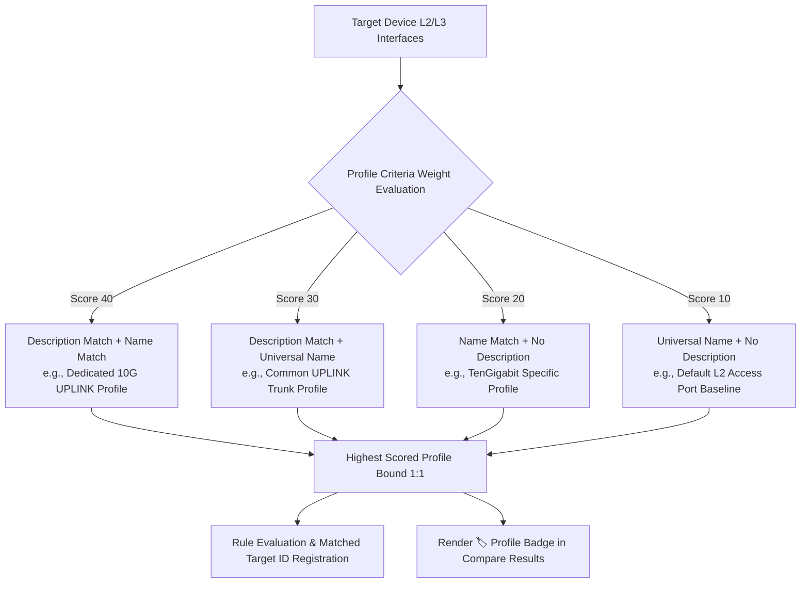

# Network Config Auditor (FastAPI + ciscoconfparse2 + Ollama)

A high-performance enterprise solution for hierarchical configuration analysis, Golden Config compliance auditing, **unauthorized extra configuration diff detection**, **security risk categorization (DANGER / WARNING / INFO)**, and **smart rollback CLI generation** for Cisco IOS-XE, NX-OS, IOS-XR, AireOS (WLC), and classic IOS devices.

---

## 📑 Table of Contents
1. [Core Architecture & Key Capabilities](#-core-architecture--key-capabilities)
2. [L2/L3 Interface Policy Profiles & Semantic Binding](#-l2l3-interface-policy-profiles--semantic-binding)
3. [Security Threat Classification & Global Standards (CIS & DISA STIG)](#-security-threat-classification--global-standards-cis--disa-stig)
4. [Declarative Git-Ops Management System](#-declarative-git-ops-management-system)
   - [Why SQLite is Git-Ignored & How Git-Ops Solves It](#why-sqlite-is-git-ignored--how-git-ops-solves-it)
   - [Declarative File Architecture](#declarative-file-architecture)
   - [Continuous Update & Team Collaboration Workflow](#continuous-update--team-collaboration-workflow)
5. [Technology Stack](#-technology-stack)
6. [Installation & Quick Start](#-installation--quick-start)
7. [E2E Automated Testing](#-e2e-automated-testing)
8. [Project Directory Layout](#-project-directory-layout)

---

## 🚀 Core Architecture & Key Capabilities

### 1. `ciscoconfparse2`-Powered Hierarchical Tree Parsing & Sanitization
- **CiscoConfParse Engine**: Accurately parses nested parent-child block relationships (`ConfigTree`) for complex interface, routing, AAA, and ACL statements.
- **Terminal Noise Sanitization**: Automatically cleans non-configuration noise such as prompt banners (`Router# show running-config`), session banners, and timestamp logs.
- **Multi-Line Banner Preservation**: Preserves special multi-line delimiter blocks (e.g. `banner motd ^C ... ^C`) without corruption.

### 2. Silent Threat Detection (Extra Config Diff & 100% Compliance Audits)
- Even when a target device achieves 100% compliance with golden rules, any unexpected, unauthorized configuration lines outside the baseline are immediately captured in `extra_configs`.
- **Block-level vs Line-level Granularity**: Clearly distinguishes between an entirely new configuration block (`is_block_extra`) and unauthorized commands within an existing block.

### 3. Intelligent Rollback CLI & Clean Config Generation
- **Context-Aware Rollback Commands**: Enters the exact parent context (e.g., `interface GigabitEthernet1`) before generating `no <command>`, or tears down entire blocks with `no <block>`.
- **Smart Security Reversal**: Reverts disabled defenses (e.g., `no switchport port-security` is inverted back to `switchport port-security`).
- **Complete CLI Scripts**: Generated remediation scripts safely start with `configure terminal` and conclude with `end` and `write memory`.
- **Clean Config Export**: Instantly download sanitized device configs where unauthorized extra lines are commented out with `! [REMOVED_BY_AUDITOR]`.

### 4. Real-Time Template Sync & Change Detection (Reactive Engine)
- When a golden template is modified in the Golden tab, a **real-time change alert banner** activates across the Compare tab.
- Operators are given immediate choices to re-audit with the updated rules or safely revert to the previous state.

---

## 🏷️ L2/L3 Interface Policy Profiles & Semantic Binding

Switches and routers have dozens to hundreds of interfaces. Naming schemes vary across hardware models (e.g., `GigabitEthernet0/0/1` vs `TenGigabitEthernet1/0/48`), and interfaces require vastly different security and transport rules depending on their role (e.g., Access edge, Core/Dist uplink, Wireless AP).

This platform delivers an **Interface Policy Profile Architecture** that eliminates hardcoded port numbers by dynamically binding the optimal ruleset based on **4-way Port Name Conditions** and **Description Semantic Matching**.

### 1. 4-Way Port Name Matching Conditions
| Condition | Definition | Sample | Target Interface Scope |
| :--- | :--- | :--- | :--- |
| **`exact`** | 100% exact match to specific interface name | `GigabitEthernet0/0` | Out-of-band management or fixed interfaces |
| **`contains`** | Name contains substring | `TenGigabitEthernet` | 10G/40G/100G high-speed uplink groups |
| **`regex`** | Regular expression match | `^(Gigabit\|TenGigabit)[0-9]/[0-9]/4[0-8]$` | Specific module ranges (e.g., ports 40-48) |
| **`exists`** | **Empty value (or `.*`) represents ALL L2 or L3 interfaces** | (Empty) | **Baseline standard for all Access ports or all Routed interfaces** |

### 2. Description Pattern Semantic Dynamic Binding
Regardless of physical port naming, the engine analyzes `description` keywords or regex patterns to target mandatory/optional commands:

- **`contains`**: Matches when description contains keyword (e.g., `UPLINK`, `TO-CORE`, `SERVER`, `AP-`)
- **`regex`**: Matches when description conforms to pattern (e.g., `^(CORE|DIST)-SW[0-9]+`)
- **`exact`**: Exact match against the description string
- **`exists`**: Applies to any interface with a description configured
- **`none`**: Ignores description and binds solely via port name criteria

### 3. Priority Scoring & 1:1 Dynamic Binding
Each interface on the target device is evaluated against all defined profiles using weighted priority scoring:



### 4. Web UI Configuration Guide
1. **Navigate to Interface Profiles**:
   - In the `Golden` tab, click a template card to open the drawer.
   - Click the **[🏷️ 인터페이스 정책 (L2/L3 Profiles)]** subtab.
2. **Add a New Profile**:
   - Click **[+ 정책 프로파일 추가]** to launch the modal dialog.
   - Configure **Profile Name**, **Interface Type** (`L2 Switchport` or `L3 Routed Interface`), **Port Name Condition**, and **Description Condition**.
3. **Define Command Ruleset**:
   - In the inline table, register mandatory/optional commands (e.g., `switchport mode trunk`, `switchport nonegotiate`, `spanning-tree portfast`) with matching condition types (`exact`, `contains`, `regex`, `exists`).
4. **Save and Audit**:
   - Click **[프로파일 적용]** and save the template.
   - Run audit in the Compare tab; interfaces will display bound `🏷️ <Profile Name>` badges with precise compliance audits and remediation scripts.

### 5. Hierarchical Rules vs. Interface Policy Profiles: Relationship & Delegation
- **Division of Responsibility**:
  - **Hierarchical Interface Rules**: Reserved strictly for **fixed individual interfaces** that must exist with exact naming on all devices, such as `Loopback0` (Router-ID), `Management0` (OOB management), or fixed SVI management VLANs.
  - **Interface Policy Profiles**: Dynamically audits dozens to hundreds of **general physical ports (Access, Trunk, AP, Server uplinks)**.
- **One-Click Profile Delegation**:
  - In the Rule Editor, an informative tip banner and **[🏷️ 인터페이스 정책으로 위임 (선택 해제)]** button appear at the top of the `interfaces_l2` and `interfaces_l3` blocks.
  - With a single click, operators can deselect all physical ports in the hierarchical rules, seamlessly delegating interface audits to dynamic Interface Policy Profiles.

---

## 🛡️ Security Threat Classification & Global Standards (CIS & DISA STIG)

The system maps extra configuration lines directly against established cybersecurity benchmarks: **CIS Cisco IOS Benchmark (v4.1.0)** and **US DoD DISA Network Infrastructure STIG**:

| Severity | Definition | Standard Mapping | Sample Patterns | Operational & Security Impact |
| :---: | :--- | :--- | :--- | :--- |
| **`DANGER`** | Critical vulnerability, backdoor injection, sniffing, or complete access control bypass | • CIS 1.1 / DISA STIG NET-0410<br>• CIS 1.2 / DISA STIG NET-0450<br>• CIS 1.3 / DISA STIG NET-0800<br>• CIS 2.1 (L2 Hardening)<br>• CIS 3.1 / DISA STIG NET-0600 | • `username ... priv 15`<br>• `snmp-server community ... rw`<br>• `snmp-server community public`<br>• `transport input telnet`<br>• `ip http server`<br>• `no switchport port-security`<br>• `no service password-encryption`<br>• `permit ip any any` | **Full Device Compromise & Defense Disable**<br>- Unauthorized privilege 15 accounts grant backdoor root access.<br>- SNMP write permissions enable remote reconfiguration.<br>- Cleartext Telnet exposes credentials to network sniffers.<br>- Disabled port security exposes switch to MAC flooding. |
| **`WARNING`** | Traffic redirection, unauthorized routing injection, expanded attack surface | • CIS Routing Security<br>• RFC 7454 (BGP Ops)<br>• CIS 1.4 (Unneeded Services)<br>• Network Architecture Policy | • `router ospf ...` / `router bgp ...`<br>• `ip route ...`<br>• `ip vrf ...`<br>• `username <user>` (Non-priv)<br>• `service config`<br>• `ip bootp server` / `ip finger`<br>• `ip address ...` (Unapproved) | **Traffic Deviation & Routing Loops**<br>- Rogue routing processes risk route leaking and blackholing.<br>- Unapproved static routes divert traffic to unauthorized gateways.<br>- Legacy active services widen the network attack surface. |
| **`INFO`** | General operational configuration additions, descriptions, minor parameters | • General Operational Audit | • `description ...`<br>• `ntp server ...`<br>• `logging ...`<br>• Parameter fine-tuning | **Operational Changes**<br>- Non-exploitative configuration drift tracked for full operational auditability. |

---

## 📦 Declarative Git-Ops Management System

### Why SQLite is Git-Ignored & How Git-Ops Solves It
- **Context**: The SQLite database (`webapp/data.db`) contains sensitive device audit histories, credentials, and customer config snapshots. It is intentionally registered in `.gitignore`.
- **The Challenge**: When cloning to new developer machines or deploying to production, `data.db` is omitted, causing Golden Templates and security policies to be missing.
- **The Solution**: Network Config Auditor employs a **declarative Git-Ops architecture**. All security rules and baseline templates reside as version-controlled JSON files in Git:

```
[Git Repository (Version Controlled)]
 ├── rules/security_rules.json       <-- Security policy ruleset
 └── seeds/templates/*.json          <-- Baseline Golden Template Seeds
         │
         ▼ (Auto-Seeding on Startup & Web UI Sync)
[Local Runtime (data.db - .gitignore)]
 ├── SQLite Tables: templates, results, settings
 └── Device audit logs and local customizations preserved
```

### Declarative File Architecture

1. **Declarative Security Rules (`rules/security_rules.json`)**:
   Tracks regex inspection patterns, mapped standards, severity levels, and remediation steps.
2. **Golden Template Seeds (`seeds/templates/*.json`)**:
   Stores golden baseline definitions for each network tier (e.g., `standard-core-iosxe.json`).

### Continuous Update & Team Collaboration Workflow

- **Auto-Seeding**: When the server launches on a fresh clone, `seed_templates_from_disk()` automatically populates empty databases from disk templates without overwriting existing data.
- **Exporting to Seed**: After refining templates in the Golden web GUI, navigate to `Settings` and click **[📤 Export to Seed JSON]**. Commit and push the resulting file to Git.
- **Importing & Hot-Reloading**: After running `git pull`, operators can hot-reload rules and import updated seed templates with a single click in the `Settings` tab without restarting the server.

---

## 🛠 Technology Stack

- **Backend**: Python 3.12, FastAPI, Uvicorn, SQLAlchemy
- **Parsing Engine**: `ciscoconfparse2 >= 0.8.0` (CiscoConfParse)
- **Policy Engine**: Declarative regex classifier (`security_policy.py`)
- **Frontend**: Modern Dark-Themed UI, Vanilla ES6+ JavaScript, CSS
- **AI/LLM**: Ollama Local API (Llama 3 / Mistral)
- **Testing**: `pytest`, `playwright`, `pytest-playwright`

---

## 💻 Installation & Quick Start

```bash
# 1. Sync dependencies with uv
uv sync

# 2. Run backend server (auto-seeds baseline templates)
uv run uvicorn webapp.main:app --host 0.0.0.0 --port 8000
```
Open `http://localhost:8000` in your web browser.

---

## 🧪 E2E Automated Testing

```bash
# 1. Run Playwright E2E browser test suite
uv run pytest tests/test_audit_e2e_playwright.py -v

# 2. Verify config parsing against real device samples
uv run python test_parse.py samples
```

---

## 📁 Project Directory Layout

```
config-auditor/
├── rules/
│   └── security_rules.json       # [Git] CIS / DISA STIG Security Policy Rules
├── seeds/
│   └── templates/                # [Git] Standard Golden Template Seeds
│       └── standard-core-iosxe.json
├── samples/                      # Real device configuration samples
│   ├── sample-1.txt
│   └── sample-1-Orig.txt         # Security vulnerability test sample
├── tests/
│   └── test_audit_e2e_playwright.py # Playwright automated E2E test suite
├── webapp/
│   ├── main.py                   # FastAPI routing, auto-seeding & sync endpoints
│   ├── core/
│   │   ├── parser.py             # ciscoconfparse2 hierarchical parser
│   │   ├── comparator.py         # Compliance, Extra Config diff & rollback engine
│   │   ├── security_policy.py    # Git-Ops declarative loader & seeder
│   │   └── llm.py                # Ollama report engine
│   ├── db/
│   │   └── database.py           # SQLite persistence models
│   ├── static/                   # Frontend assets
│   └── data.db                   # [.gitignore] Local runtime database
└── README.kr.md / README.md      # Comprehensive manuals
```
